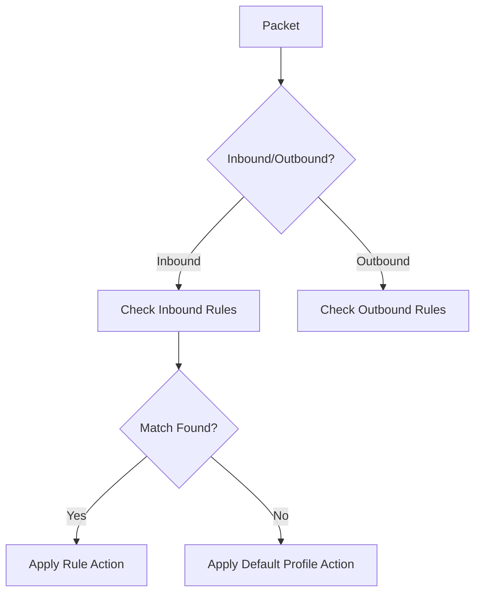

``
# Windows Firewall Traffic Filtering - Technical Deep Dive

## Core Filtering Mechanisms

### 1. Rule Processing Architecture


### 2. Filtering Types

#### a) Port-Based Filtering
**Example: Block Telnet**
```powershell
New-NetFirewallRule -DisplayName "Block_Telnet" -Direction Inbound -Protocol TCP -LocalPort 23 -Action Block
```

**Key Properties:**
- `LocalPort`: Single port (23), range (20-30), or comma-separated (80,443)
- `Protocol`: TCP/UDP/ICMPv4/ICMPv6/Any

#### b) Application-Based Filtering
**Example: Allow Chrome**
```powershell
New-NetFirewallRule -Program "C:\Program Files\Google\Chrome\Application\chrome.exe" -Action Allow
```

#### c) Service Filtering
**Example: Block SMB**
```cmd
netsh advfirewall firewall add rule name="Block_SMB" dir=in action=block protocol=TCP localport=445 service=any
```

### 3. Rule Precedence Hierarchy
1. **Explicit Block Rules** (Highest priority)
2. **Explicit Allow Rules**
3. **Default Profile Actions** (Lowest priority)

**Verification Command:**
```powershell
Get-NetFirewallRule | Sort-Object -Property Direction,Action | Format-Table -AutoSize
```

## Advanced Features

### Stateful Inspection
Windows Firewall maintains a **state table** tracking:
- TCP handshakes (`SYN`, `ACK`, `FIN`)
- UDP pseudo-connections
- ICMP error messages

**Example: Allow HTTP Responses**
```cmd
netsh advfirewall firewall add rule name="Allow_HTTP_Responses" dir=in action=allow protocol=TCP localport=80 remoteip=any status=ESTABLISHED
```

### Logging & Diagnostics
**Enable Debug Logging:**
```cmd
netsh advfirewall set currentprofile logging filename %SystemRoot%\System32\LogFiles\Firewall\pfirewall.log
```

**Log Analysis Patterns:**
```log
# Blocked inbound TCP
DROP TCP 192.168.1.100:52345 → 10.0.0.5:23 FILTER=BLOCK_TELNET

# Allowed outbound UDP
ALLOW UDP 10.0.0.5:137 → 8.8.8.8:53 FILTER=DNS_Client
```

## Windows vs. Linux Filtering

| Feature              | Windows Firewall                  | Linux UFW                     |
|----------------------|-----------------------------------|-------------------------------|
| Configuration        | GUI + CLI (netsh/PowerShell)      | CLI only                      |
| Default Policy       | Block inbound/Allow outbound      | Same                          |
| State Tracking       | Full TCP/UDP state machine        | Basic connection tracking     |
| Application Control  | EXE path/SHA256 hashes            | Limited (port-based mainly)   |
| Log Integration      | Event Viewer/Security logs        | syslog/journald               |

## Practical Filtering Scenarios

### Scenario 1: Block Brute Force Attacks
```powershell
# Block IP after 3 failed RDP attempts
New-NetFirewallRule -DisplayName "Block_RDP_Attacker" -Direction Inbound -Protocol TCP -LocalPort 3389 -RemoteAddress 192.168.1.100 -Action Block
```

### Scenario 2: Allow Cloud Backup
```cmd
netsh advfirewall firewall add rule name="Allow_Backup" dir=out action=allow protocol=TCP remoteport=443 remoteip=52.34.56.78
```

## Performance Considerations
- **Rule Count Impact**: Each additional rule adds ~0.5ms latency
- **Optimization Tip**:
  ```powershell
  # Group similar rules
  New-NetFirewallRule -DisplayName "Allow_Web" -Direction Outbound -Protocol TCP -RemotePort @(80,443,8080) -Action Allow
  ```

## Verification Commands
```powershell
# View active connections with firewall decisions
Get-NetTCPConnection | Where-Object { $_.State -eq "Established" } |
    Select-Object LocalAddress,LocalPort,RemoteAddress,RemotePort,
        @{n="FirewallAction";e={(Get-NetFirewallPortFilter -LocalPort $_.LocalPort).Action}}
```

## References
- [Microsoft Docs: Windows Firewall Architecture](https://docs.microsoft.com/en-us/windows/security/threat-protection/windows-firewall/windows-firewall-with-advanced-security)
- [NIST SP 800-41 Guidelines](https://csrc.nist.gov/publications/detail/sp/800-41/rev-1/final)
```

